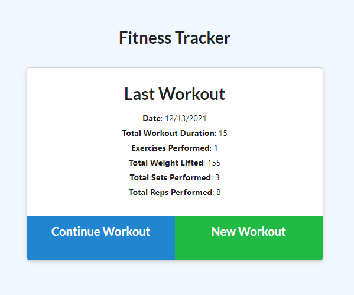

# Workout Tracker
## Description

The Workout Tracker is an online tool to store and visualize your daily and weekly workouts. It utilizes MongoDB and Mongoose to store the user's workout data, including each exercise and the day they were performed. It was built to give the user an easy way to track their fitness progress in hopes that they can establish good exercising habits and meet their personal goals. I utilized my knowledge of models, database creaiton, and routes to complete this project.

## Table of Contents 
- [Installation](#installation)
- [Usage](#usage)
- [Credits](#credits)
- [License](#license)

## Installation
To install the Workout Tracker, first download the files from the Github repo, open a terminal inside the appropriate folder, and run "npm install". If you wish to seed your database with some starter data, just run "npm run seed" next. Finally, to launch the server locally enter "nodemon server.js" or "node server.js". 

## Usage

To begin using the Workout Tracker, first go to https://evening-sands-65482.herokuapp.com/ . Next, click New Workout to begin a new workout. Enter your workout information, specifying a cardio or a resistance workout, the duration, and the distance or weight. Once you have entered your information, click Add Exercise to add the exercise to your daily total and begin entering a new exercise, or Complete to finish entering your workouts. Once you are back at the homepage, your workout stats will be displayed in the middle of the page. You can click Continue Workout to add more exercises just as before, click New Workout to begin a new workout, or click the Dashboard button in the top left corner to see a graphical view of your last 7 workouts.

## Credits
The Github repository resides at https://github.com/tjtahmas/Workout-Tracker

You can contact me with any questions or comments about the project at tjtahmas@gmail.com

## License

MIT License

Copyright (c) 2021 Thomas Tahmassebi

Permission is hereby granted, free of charge, to any person obtaining a copy
of this software and associated documentation files (the "Software"), to deal
in the Software without restriction, including without limitation the rights
to use, copy, modify, merge, publish, distribute, sublicense, and/or sell
copies of the Software, and to permit persons to whom the Software is
furnished to do so, subject to the following conditions:

The above copyright notice and this permission notice shall be included in all
copies or substantial portions of the Software.

THE SOFTWARE IS PROVIDED "AS IS", WITHOUT WARRANTY OF ANY KIND, EXPRESS OR
IMPLIED, INCLUDING BUT NOT LIMITED TO THE WARRANTIES OF MERCHANTABILITY,
FITNESS FOR A PARTICULAR PURPOSE AND NONINFRINGEMENT. IN NO EVENT SHALL THE
AUTHORS OR COPYRIGHT HOLDERS BE LIABLE FOR ANY CLAIM, DAMAGES OR OTHER
LIABILITY, WHETHER IN AN ACTION OF CONTRACT, TORT OR OTHERWISE, ARISING FROM,
OUT OF OR IN CONNECTION WITH THE SOFTWARE OR THE USE OR OTHER DEALINGS IN THE
SOFTWARE.
---